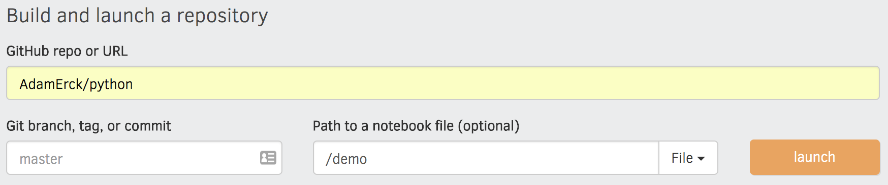

# Jupyter Notebook 
## Letter Frequency Analysis

 

## Open an interactive notebook:   

  

  

### More links
* Presentation: https://docs.google.com/presentation/d/1IJkDNPHHhSDKv-6CWs5usuZYiUNn3q9Kq5DtK4EE2DI/edit?usp=sharing
* Existing Notebook Instance: https://mybinder.org/v2/gh/AdamErck/python/master?filepath=letter-freq.ipynb
* Create New Notebook: https://mybinder.org/
    * GitHub repo or URL: <kbd>AdamErck/python</kbd>
    * Path to a notebook file: <kbd>letter-freq.ipynb</kbd>   
    
* GitHub repository: https://github.com/AdamErck/python
